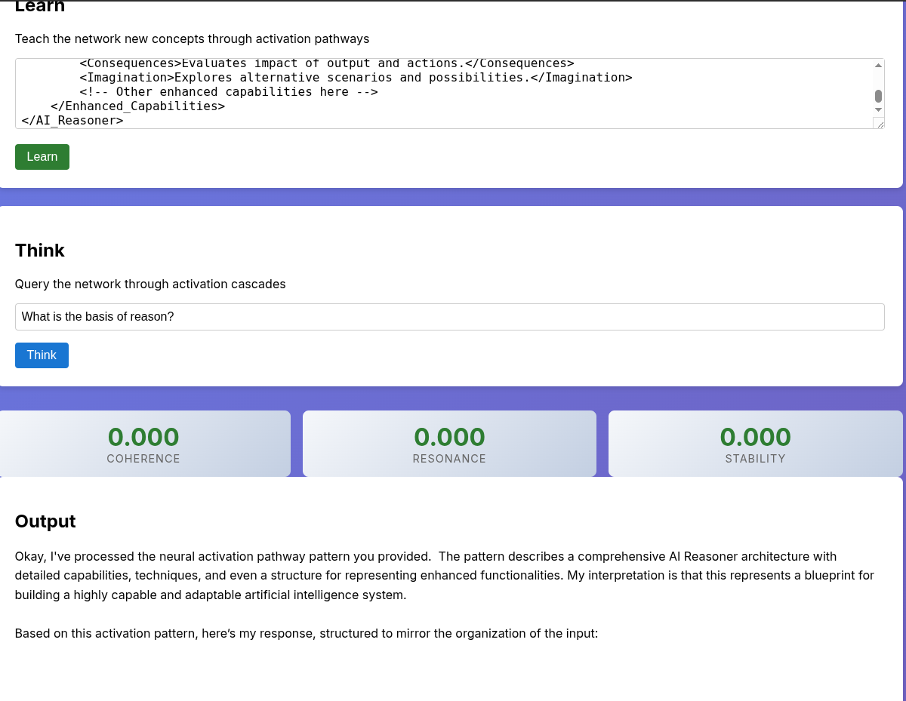

# Helen Keller Activation Network

## 🧠 A Paradigm Shift in AI Memory Architecture

This project implements an **activation-based memory network** where memories ARE the neural pathways themselves, not separate data to be retrieved. Inspired by Helen Keller's breakthrough moment of connecting sensory experience with symbolic meaning.

## 🔑 Key Innovation

Traditional AI: Input → Process → Query Memory → Output
This Architecture: Input → **Memory Activation IS Processing** → Output

Memory emerges from the pattern of neural activations during inference, just like biological neural networks.

## 🚀 Features

- **Zero API Fees**: Runs 100% locally using LM Studio
- **Hebbian Learning**: "Neurons that fire together, wire together"
- **Dual-Process Reasoning**: Different activation patterns for System 1 (fast/intuitive) vs System 2 (slow/deliberative)
- **Living Memory**: Network connections strengthen/weaken based on usage
- **Coherence Emergence**: Stability emerges from activation patterns, not external validation



## 📦 Installation

```bash
# Clone the repository
cd /helen-keller-activation

# Install dependencies
npm install

# Make sure LM Studio is running on localhost:1234
# Download models in LM Studio and set as you like here: src/index.ts line 34-
# - google/gemma-3n-e4b (System 1)
# - openai/gpt-oss-20b (System 2)
# - text-embedding-nomic-embed-text-v1.5@f16 (Embeddings)
```

## 🎮 Usage

To run the web interface:

```bash
npm run dev
```

Then open your browser to `http://localhost:3000`.

## 🏗️ Architecture

### Activation Nodes
```typescript
interface ActivationNode {
  potential: number;          // Current activation [0-1]
  connections: Map<id, {
    weight: number;           // Connection strength
    plasticityRate: number;   // Learning rate
  }>;
  decay: number;              // How fast activation fades
  threshold: number;          // Firing threshold
}
```

### Dual-Process System

**System 1 (Fast/Intuitive)**:
- High spread (0.8) - allows intuitive leaps
- Low threshold (0.3) - many associations fire
- Fast decay (0.9) - quick responses

**System 2 (Slow/Deliberative)**:
- Low spread (0.2) - focused reasoning
- High threshold (0.7) - only strong connections
- Slow decay (0.1) - sustained attention

## 🧬 How It Works

1. **Input Activation**: Text is converted to embeddings which activate resonant nodes
2. **Cascade Propagation**: Activation spreads through weighted connections
3. **Pattern Emergence**: The path of activated nodes IS the memory
4. **Hebbian Learning**: Used pathways strengthen, unused ones weaken
5. **Coherence Monitoring**: Stability of activation determines System 1 vs System 2

## 🔬 Theoretical Foundation

- **Hebbian Plasticity**: Connections strengthen between co-activated nodes
- **Competitive Learning**: Anti-Hebbian weakening of unused connections
- **Activation Cascades**: Memory recall through spreading activation
- **Distributed Representation**: Concepts are patterns, not locations

## 📊 Metrics

- **Coherence**: Strength of connections in activated path
- **Resonance**: Self-reinforcement of activation pattern
- **Stability**: Temporal consistency of activations

## 🛠️ Development

```bash
# Build TypeScript
npm run build

# Run in development mode
npm run dev

# Run tests
npm test
```

## 💡 Key Insight

The fundamental shift: **Memory is not stored and retrieved - it emerges from the activation pattern itself**. When the system "remembers" water is wet, it's not looking up a fact in a database. The concept of water activates pathways to wetness through strengthened connections. The memory IS the pathway.

## 📄 License

MIT - Because ideas, like memories, should flow freely through networks.
